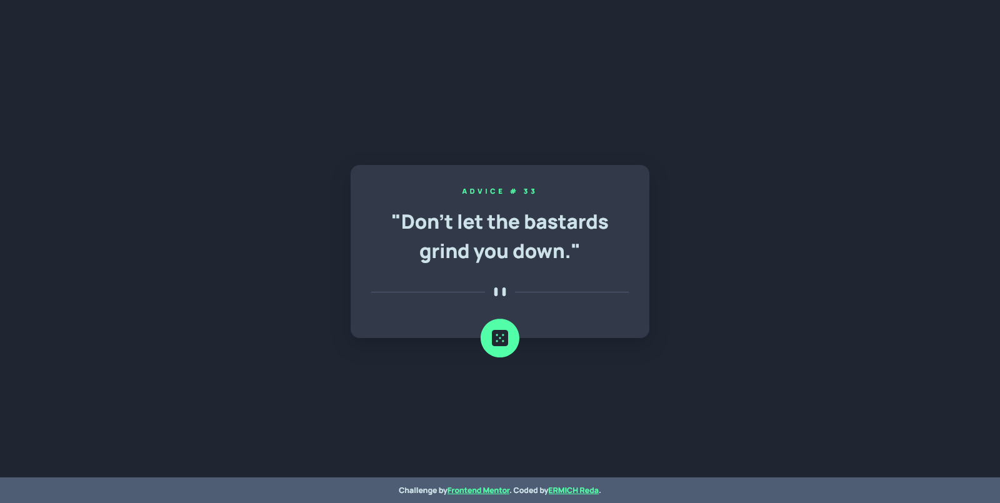
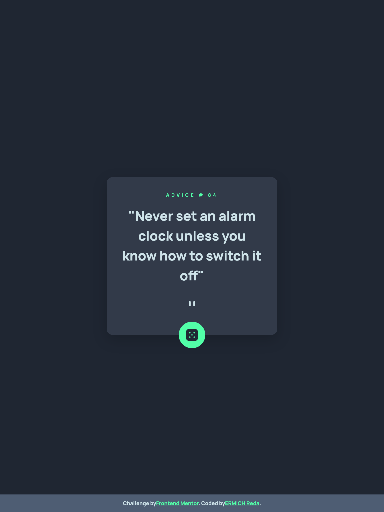
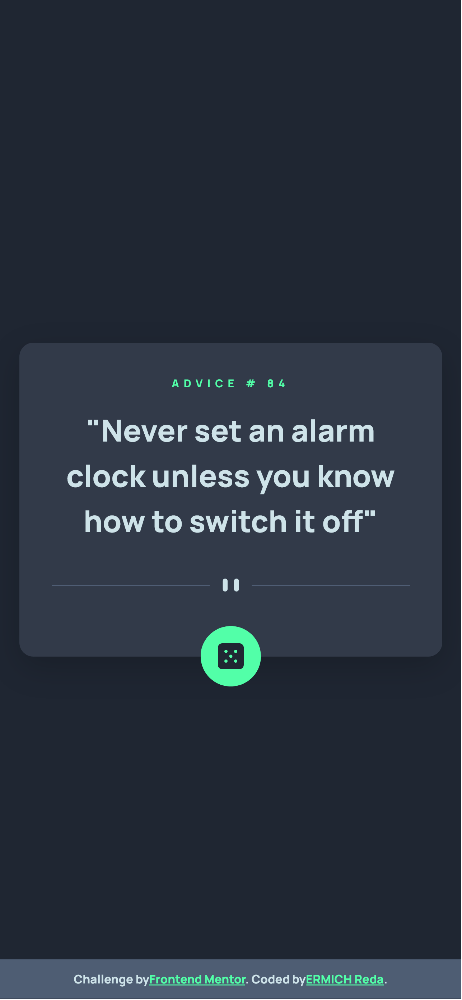

# Advice generator app solution

This is a solution to the [Advice generator app challenge on Frontend Mentor](https://www.frontendmentor.io/challenges/advice-generator-app-QdUG-13db).

## Table of contents

- [Advice generator app solution](#advice-generator-app-solution-)
  - [Table of contents](#table-of-contents)
  - [Overview](#overview)
    - [The challenge](#the-challenge)
    - [Screenshot](#screenshot)
    - [Links](#links)
  - [My process](#my-process)
    - [Built with](#built-with)
    - [What I learned](#what-i-learned)
    - [Continued development](#continued-development)
    - [Useful resources](#useful-resources)
  - [Author](#author)

## Overview

### The challenge

Users should be able to:

- View the optimal layout for the app depending on their device's screen size
- See hover states for all interactive elements on the page
- Generate a new piece of advice by clicking the dice icon

### Screenshot





### Links

- Solution URL: [advice-generator-app-api](https://github.com/ermix3/advice-generator-app-api)
- Live Site URL: [Live](https://ermix3.github.io/advice-generator-app-api/)

## My process

### Built with

- Semantic HTML5 markup
- CSS custom properties
- Flexbox
- Mobile-first workflow
- [Typescript](https://www.typescriptlang.org/) - TS language
- [Gulp](https://gulpjs.com/) - Gulpjs task runner
- [Sass](https://sass-lang.com/) - CSS Preprocessor
- [Bootstrap](https://getbootstrap.com/) - CSS Framework
- [Pug](https://pugjs.org/api/getting-started.html) - Html Template engine

### What I learned

> I learn more about gulpjs and practice typescript language this time, really i learn a lot about API and that exactly what i want in the first place to be honest from this challenge thank you team [Frontend Mentor](https://www.frontendmentor.io/).

### Continued development

> In the command line

```bash
  npm install
```

> Then to watch the change's run the command

```bash
  gulp
```

### Useful resources

- [Example resource 1](https://www.example.com) - This helped me for XYZ reason. I really liked this pattern and will use it going forward.
- [Example resource 2](https://www.example.com) - This is an amazing article which helped me finally understand XYZ. I'd recommend it to anyone still learning this concept.

## Author

- Website - [ermix3](https://github.com/ermix3)
- Frontend Mentor - [@ermix3](https://www.frontendmentor.io/profile/ermix3)
- Twitter - [@re_ermix](https://www.twitter.com/re_ermix)
